#SMTP
@(博客)[python, smtp, Python]

[TOC]

018.6.16

##背景
室友选修的《机器学习》，结课作业是对8万+的数据进行分析。他向我抱怨，说这么多数据至少得运算半个多小时，还得语法逻辑不出错，不然得重来。
“总不能守着电脑吧，想出去玩，又拿不准程序准确结束时间。”
我想python作为编程界的万金油，几乎不存在它不能染指的地方。所以有了以下基于smtp协议、利用python自带模块email，smtplib实现自动化发送邮件的代码。

##SMTP了解一下
有必要简单了解一下SMTP的概念，可以加深对代码的理解。

所以什么是SMTP呢？
SMTP是**简单邮件传输协议**，不过只能传送可打印的7位ASCII码邮件，这样存在过大的局限性。于是后来有了MIME，即**通用互联网邮件扩充**。MIME在邮件首部中说明了邮件的数据类型（如文本，声音，图像，视像等），且通过MIME邮件可以同时传送多种类型的数据（附件）。

##邮件系统
一个邮件系统应该具有三个主要组成构建。用户代理、邮件服务器，邮件发送协议（SMTP）和邮件读取协议（POP3，又：邮局协议）
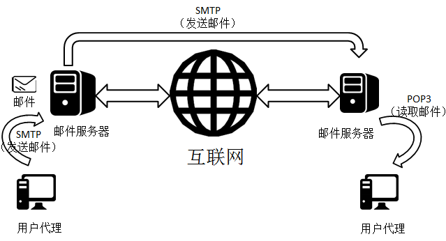

##实现过程
###1.连接建立
SMTP客户端（发送方的邮件服务器）每隔一定时间对邮件缓存扫描，如果发现有邮件，就用25端口与接收方的SMTP服务器建立TCP连接。连接建立后，接收方服务器发出“服务就绪”，SMTP客户端向SMTP服务器发送HELO命令，附上发送方的主机名。SMTP服务器如果有能力接受邮件，就回复“250”(OK)，如果服务不可用回复“421”。

###2.邮件传输
略

###3.连接释放
邮件发送完毕后，SMTP客户发送QUIT命令。SMTP服务器返回“221”(服务关闭)，表示同意释放TCP连接。邮件传输过程结果。

###4.注意项目
==1. SMTP不使用中间邮件服务器，一定是发送方服务器到接收方服务器==
==2. 为什么要通过邮件服务器而不是直接发送方用户代理-->接收方用户代理呢？原因很简单，被人给你发送邮件的时候你并不一定在==

##信息格式
一个邮件分为**信封**和**内容**两大部分，内容包含**首部**、**主体**。
1. 首部(header)，有规定格式，比较重要有以下：
"To" 接收方邮件地址
"Subject" 邮件主题
"From" 发送方邮件地址
2. 主体(body)，允许用户自由撰写

##MIME新增关键字
1. MIME-Version：标志MIME的版本
2. Content-Description：可读字符串，说明邮件主体是否是图像、音频或视频
3. Content-Id：邮件的唯一标识符
4. Content-Transfer-Encoding：传送邮件时邮件的主体是如何编码的（常用三种编码：ASCII，quoted-printable，base64）
5. Content-Type：说明邮件主体的数据类型和子类型。MIME规定Content-Type必须含有两个标识符，即**类型**和**子类型**，中间中“/”分开（举例：text/plain）
6. Content-Disposition：disposition-type;disposition-parm  参数意义：disposition-type表示以什么方式下载（通常值为`attachment`，即以附件形式下载）；disposition-parm表示文件保存的默认名

##multipart
1. 邮件主体的数据类型之一，表示多种类型的组合（只介绍这一个数据类型是因为，后面会基于这个类型用python实现）
2. 常用子类型：**mixed**，表示允许单个报文含有多个相互独立的子报文（理解邮件中的“附件”概念）
3. boundary关键字，定义分隔报文各部分所用的字符串（邮件系统定义，用户不用关心）

##自动发邮件
有了以上对SMTP知识简单的梳理之后，就可以很容易理解后面的代码。而这里我是通过登陆自己的邮箱来实现发送邮件，这样做的目的是：如果不登陆自己的邮箱，发送出去的邮件很容易被误认为垃圾邮件，或是被屏蔽，或是在垃圾箱，接收方不能及时收取。

python内置两个模块，email和smtplib，前者负责构建一封邮件，后者实现发送

###构建过程
基于python创建一封邮件，使用的是email模块，我会用不严谨、但尽可能生动的语言来解释对象的内置方法
```python
from email.mime.multipart import MIMEMultipart 
from email.mime.text import MIMEText


aLetter = MIMEMultipart() #实例化“一个包裹”
# attach()，往包裹里面放东西
# MIMEText()可以看做一封信，第一个参数表示内容，第二个表示类型，第三个表示编码格式
aLetter.attach(MIMEText("hello,world", "plain", "utf-8")) 
# 在“包裹”上写上发给谁（to），发的什么（subject），谁发的（from）
aLetter["To"] = "xxxxx@qq.com"
aLetter["Subject"] = "Greet"
aLetter["From"] = "myemail@qq.com"

# 实例化一封附加信
attachment = MIMEText("i miss you,andl you?", "plain", "utf-8")
# 说明邮件数据的主题类型和子类型
attachment["Content-Type"] = "text/plain"
# 以附件形式下载，默认文件名为happy.txt
attachment["Content-Disposition"] = "attachment;filename=happy.txt"
# 将附加信丢入包裹中
aLetter.attach(attachment)

print(aLetter) # 打印输出效果
```
于是有了下面一个“包裹”
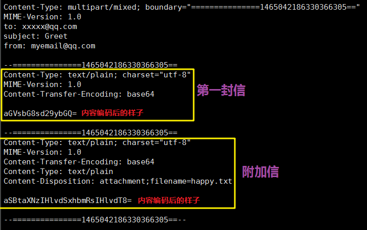


----------
有了包裹，就需要邮寄出去，这里需要用到smtplib模块来发送邮件，流程如下：
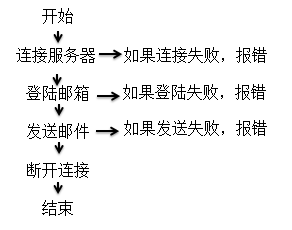
```python
# 实例化一个smtp对象
smtp = smtplib.SMTP_SSL()
# 连接邮件服务器
smtp.connect("smtp.qq.com")
# 登陆自己的邮箱
smtp.login("578306307@qq.com", "htnyrbavmhifbcga")
# 发送邮件
smtp.sendmail("578306307@qq.com", "guanyixin995@163.com", aLetter.as_string())
# 退出连接
smtp.quit()
```

如此就是一个完整的发送邮件的过程
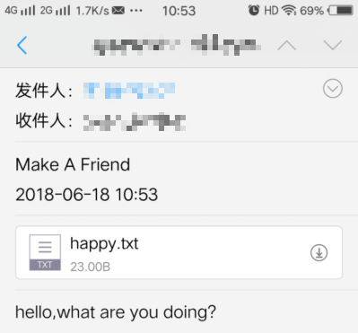

##封装代码
为了更高效的利用代码，为了使代码具有更好的扩展性，利用面向对象的思想来封装代码自然是不可少的。

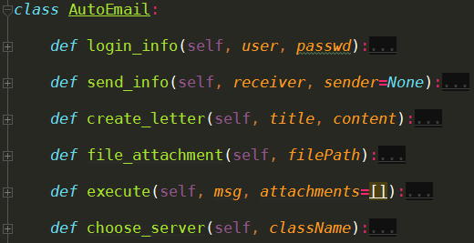
首先我写了一个AutoEmail的父类，其下有6个方法，依次对应：登陆信息，发送信息，生成邮件，生成附件，发送邮件，选择服务器。
==由于网易163邮箱和QQ邮箱连接的服务器不同，前者“smtp.163.com”，后者“smtp.qq.com”，且网易针对smtplib.SMTP()实例化对象，而QQ邮箱需要针对smtp.SMTP_SSL()==

当然，为了对用户更友好，这里我写了两个派生类来继承AutoEmail。
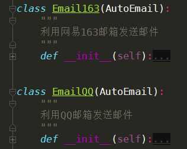

父类的choose_server()方法，通过区分实例化对象的类名，来提供相对应的方法
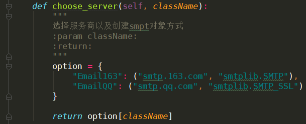

获取实例化对象的类名：`__class__.__name__`
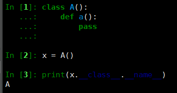

##必要的设置
1. 如果是网易邮箱
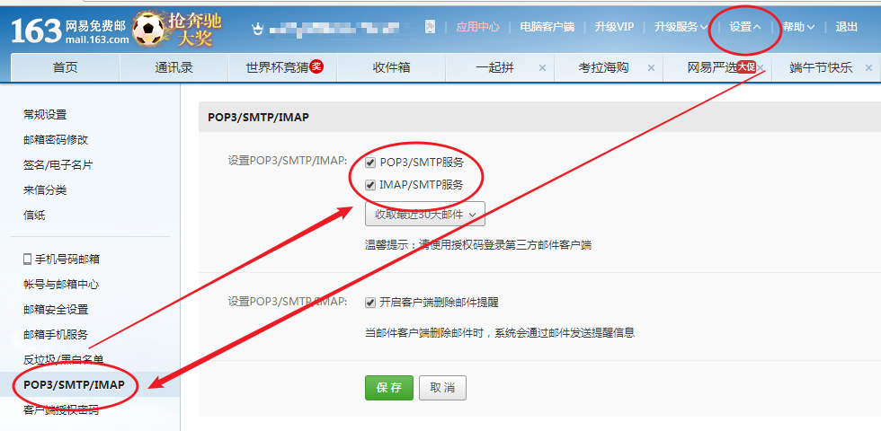

2. 如果是QQ邮箱
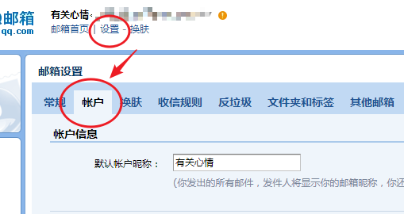
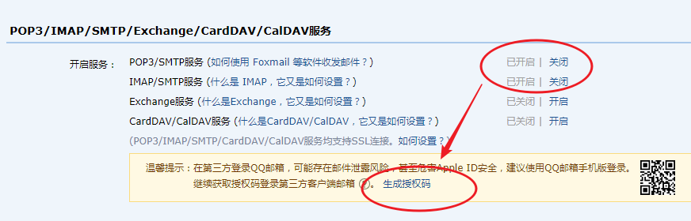

代码中的邮箱密码，不是邮箱的真实代码，而是授权密码。
